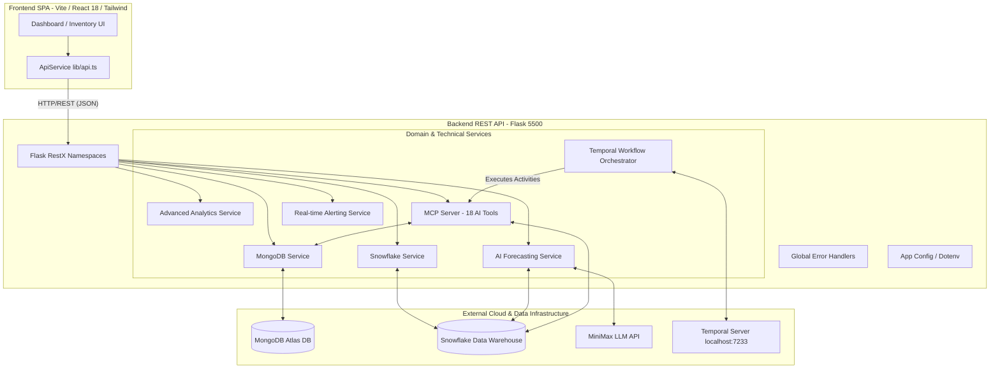
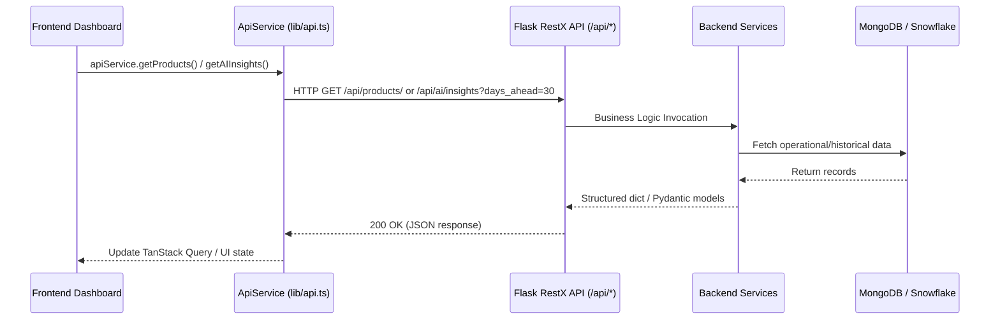

# InventoryPulse Architecture Report

## Executive Summary
**InventoryPulse** is an AI-powered, full-stack enterprise inventory management and supply chain intelligence platform. The project is split into two primary repositories cloned into the workspace:
- `/frontend`: Modern React 18 single-page application built with Vite, TypeScript, Tailwind CSS, and shadcn/ui.
- `/backend`: Python Flask REST API application integrating MongoDB Atlas (operational storage), Snowflake (analytical data warehouse), MiniMax LLM (AI forecasting & restock recommendations), Model Context Protocol (MCP server), and Temporal (workflow orchestration).

---

## 1. Technology Stack & Runtime Versions

### Frontend Architecture
- **Language**: TypeScript (`^5.5.3`) / JavaScript (ES2022)
- **Runtime Environment**: Node.js 18+ / Bun
- **Framework**: React `18.3.1`
- **Build Tool**: Vite `5.4.1` with `@vitejs/plugin-react-swc`
- **Styling & UI Design System**:
  - Tailwind CSS `3.4.11`
  - Radix UI Primitives (`@radix-ui/react-*`) & `shadcn-ui` components
  - `class-variance-authority`, `clsx`, `tailwind-merge`, `tailwindcss-animate`
- **State & Data Fetching**: `@tanstack/react-query` `5.56.2`, `fetch` API (`src/lib/api.ts`)
- **Routing**: `react-router-dom` `6.26.2`
- **Data Visualization**: Recharts `2.12.7`
- **Forms & Validation**: `react-hook-form` `7.53.0`, `zod` `3.23.8`

### Backend Architecture
- **Language**: Python 3.11+
- **Core API Framework**: Flask `2.3.3` / `3.0.x`, `flask-restx` `1.1.0` (OpenAPI/Swagger docs), `flask-cors` `4.0.0`
- **Operational Database**: MongoDB via `pymongo` `4.5.0` (MongoDB Atlas cloud deployment)
- **Analytical Data Warehouse**: Snowflake via `snowflake-connector-python` `3.3.1`
- **AI / LLM Integration**: MiniMax LLM API (`MiniMax-Text-01` / `MiniMax-M1`) via `requests`, `numpy`, `pandas`, `scipy`, `scikit-learn`
- **Workflow & Distributed Systems**: Temporal SDK (`temporalio` `1.4.0`)
- **Logging & Observability**: `structlog` `23.1.0` structured JSON logging
- **Validation & Serialization**: `pydantic` `2.3.0`, `dataclasses-json`

---

## 2. System Architecture Diagram



---

## 3. Detailed Folder Structure

```
inventorypulse/
├── frontend/
│   ├── src/
│   │   ├── components/
│   │   │   ├── Dashboard.tsx            # Main multi-tab enterprise dashboard
│   │   │   ├── ApiTestComponent.tsx     # API diagnostics & endpoint testing panel
│   │   │   ├── CustomerSupportChat.tsx  # Interactive AI chat drawer
│   │   │   └── ui/                      # 30+ shadcn-ui atomic components
│   │   ├── lib/
│   │   │   ├── api.ts                   # Strongly-typed API client wrapper
│   │   │   └── utils.ts                 # Styling & utility helpers
│   │   ├── pages/
│   │   │   ├── Index.tsx                # Main entry route
│   │   │   └── NotFound.tsx             # 404 handler page
│   │   ├── App.tsx                      # Root component with providers
│   │   ├── index.css                    # Design tokens & Tailwind CSS layers
│   │   └── main.tsx                     # React DOM entry
│   ├── package.json
│   ├── tailwind.config.ts
│   └── vite.config.ts
└── backend/
    ├── backend/
    │   ├── app.py                       # Application factory (create_app) & blueprint registry
    │   ├── config.py                    # Environment-based Config class hierarchy
    │   ├── models/                      # Domain entity models
    │   │   ├── base_model.py
    │   │   ├── product_model.py
    │   │   ├── supplier_model.py
    │   │   ├── order_model.py
    │   │   ├── alert_model.py
    │   │   └── user_model.py
    │   ├── routes/                      # Flask-RestX API Namespaces
    │   │   ├── ai_routes.py             # /api/ai endpoints
    │   │   ├── alert_routes.py          # /api/alerts endpoints
    │   │   ├── auth_routes.py           # /api/auth endpoints
    │   │   ├── health_routes.py         # /api/system endpoints
    │   │   ├── order_routes.py          # /api/orders endpoints
    │   │   ├── product_routes.py        # /api/products endpoints
    │   │   ├── supplier_routes.py       # /api/suppliers endpoints
    │   │   └── user_routes.py           # /api/users endpoints
    │   ├── services/                    # Business & Integration logic
    │   │   ├── ai_forecasting_service.py
    │   │   ├── advanced_analytics_service.py
    │   │   ├── db_service.py
    │   │   ├── mcp_service.py
    │   │   ├── real_time_alerting_service.py
    │   │   ├── snowflake_service.py
    │   │   └── temporal_service.py
    │   └── utils/
    │       └── errors.py                # Standardized JSON error response handler
    ├── tests/                           # Unit and Integration test suite
    ├── run.py                           # Development server launch script (Port 5500)
    └── requirements.txt
```

---

## 4. Database Architecture

### Operational Storage (MongoDB Atlas)
Managed via `backend.services.db_service`. MongoDB stores real-time CRUD operational state across 6 main collections:
1. `products`: Stores live inventory counts, SKUs, reorder thresholds, pricing, category metadata, and stock movement logs.
2. `suppliers`: Stores supplier profiles, contact details, reliability ratings, lead times, and active status.
3. `purchase_orders`: Tracks procurement orders, line items, order status (`draft`, `pending`, `shipped`, `delivered`), and delivery dates.
4. `alerts`: Stores active and resolved system alerts, anomaly events, low-stock triggers, and AI severity levels.
5. `users`: Stores system user credentials and profiles.
6. `stock_movements`: Tracks historical audit trails of stock adjustments.

### Analytical Warehouse (Snowflake)
Managed via `backend.services.snowflake_service`. Connected to database `AWSHACK725`, schema `PUBLIC`:
- `SALES_ANALYTICS`: Historical sales transactions, daily revenue, unit volumes, day-of-week/weekend seasonality flags.
- `INVENTORY_HISTORY`: Historical snapshot of `RECORD_ID`, `PRODUCT_ID`, `STOCK_LEVEL`, `SNAPSHOT_DATE`, and `REORDER_THRESHOLD`.

---

## 5. API Architecture & Frontend-Backend Communication

### Communication Protocol
- **Base URL**: `http://localhost:5500/api` (configured via `import.meta.env.VITE_API_BASE_URL`).
- **Data Exchange**: RESTful JSON over HTTP.
- **Documentation**: Swagger UI auto-generated at `/api/docs/`.



---

## 6. AI & MCP Architecture

### AI Forecasting & Recommendation Flow
1. **Model**: MiniMax LLM (`MiniMax-Text-01` with structured JSON schema responses or `MiniMax-M1`).
2. **Hybrid Intelligence**:
   - `AIForecastingService` pulls 90 days of sales history from Snowflake and current inventory from MongoDB.
   - Computes statistical moving averages (7-day and 30-day), inventory velocity, and volatility.
   - Prompts MiniMax with structured statistical context to produce JSON outputs containing demand forecasts, trend classification (`increasing`, `stable`, `decreasing`), risk assessment, and actionable restock recommendations.
   - Includes automatic fallback to pure statistical forecasting if the external LLM is offline or unreachable.

### Model Context Protocol (MCP) Server (`InventoryMCPServer`)
Exposes 18 structured AI tools that autonomous agents or LLM workflows can execute:
- **Core Inventory**: `get_inventory`, `check_low_stock`, `forecast_demand`, `recommend_restock`, `get_sales_analytics`, `create_alert`, `update_inventory`, `get_supplier_info`
- **AI & Predictive**: `analyze_inventory_health`, `get_predictive_insights`, `optimize_inventory_levels`, `calculate_safety_stock`, `analyze_demand_patterns`, `get_supplier_performance`, `simulate_scenarios`, `get_inventory_kpis`
- **Monitoring & Observability**: `start_monitoring`, `stop_monitoring`, `get_active_alerts`, `acknowledge_alert`, `resolve_alert`, `generate_dashboard`, `export_analytics_report`, `benchmark_performance`

---

## 7. Temporal Workflow Architecture

`TemporalInventoryService` manages durable background workflows for asynchronous supply chain automation:
- **`InventoryMonitoringWorkflow`**: Periodically audits inventory levels via activities (`check_inventory_levels`), sends alerts, and automatically spawns child restock workflows when stock drops below safety limits.
- **`RestockWorkflow`**: Orchestrates demand forecasting, purchase order generation, and notification delivery.
- **`AnomalyDetectionWorkflow`**: Continuously checks for negative stock, excess accumulation, or unexplained zero-stock anomalies.
- **`AlertProcessingWorkflow`**: Processes and escalates queued system alerts.
