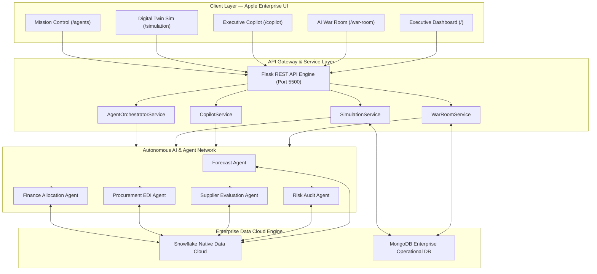
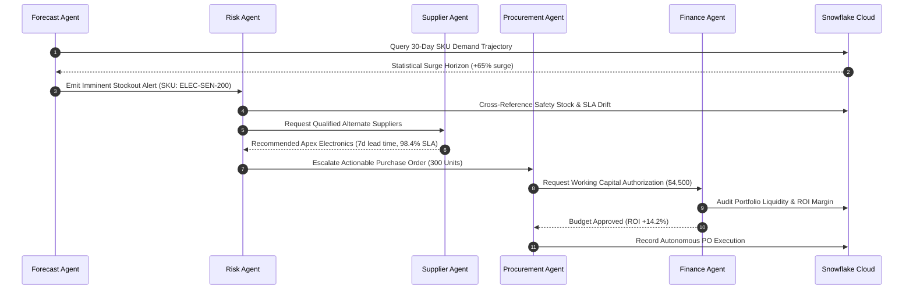

<div align="center">

# InventoryPulse AI — Frontend UI Platform

### **Autonomous Inventory Intelligence Platform (Apple Enterprise UI)**

#### *Predict. Simulate. Optimize. Act.*

[](https://github.com/ayushkumar2601/inve-front)
[](https://www.snowflake.com/)
[](https://github.com/ayushkumar2601/inve-front)
[](https://opensource.org/licenses/MIT)

<p align="center">
  <b>InventoryPulse AI transforms traditional inventory management into an autonomous decision-making platform using AI agents, predictive analytics, executive copilots, and Snowflake-powered intelligence.</b>
</p>

</div>

---

## Executive Overview

Traditional inventory systems tell businesses **what happened**—leaving executives to react to stockouts, working capital inflation, and supplier SLA failures after financial damage occurs.

**InventoryPulse AI** replaces static CRUD reporting with autonomous operations. By combining **Snowflake Data Cloud** telemetry with specialized **Level 4 Autonomous AI Agents**, InventoryPulse AI tells executive teams:

1. **What is happening**: Continuous real-time ingestion of SKU health, supplier SLA latency, and working capital exposure.
2. **Why it is happening**: Deep causal diagnostic synthesis isolating upstream bottlenecks, demand surges, and safety stock degradation.
3. **What will happen next**: Stochastic Monte Carlo forward simulation predicting stockouts up to 12 weeks before revenue impact.
4. **What action should be taken**: Autonomous EDI Purchase Order generation and pre-authorized capital execution.

---

## Key Capabilities

| Capability | Enterprise Module | Operational Description |
| :--- | :--- | :--- |
| **AI War Room** | `/war-room` | **Real-time operational intelligence center** monitoring portfolio revenue at risk, potential stockouts, and supplier SLA breaches with 1-click autonomous PO execution. |
| **Executive Copilot** | `/copilot` | **Natural language business intelligence** delivering structured 3-part executive briefs (Diagnostic Root Cause, Quantified Business Impact, Autonomous Action Plan). |
| **Autonomous Procurement Agent** | `/agents/procurement` | **AI-generated purchase recommendations** executing 4-stage EDI procurement pipelines without requiring manual human calculation. |
| **Supply Chain Digital Twin** | `/simulation` | **Scenario simulation and forecasting** powered by stochastic Monte Carlo modeling across demand surge, supplier delay, and market volatility. |
| **Multi-Agent Collaboration Layer** | `/agents` | **Specialized AI agents working together** in a consensus communication topology to audit forecasts, score suppliers, and allocate budget. |

---

## Snowflake-Powered Architecture

Snowflake is the core architectural differentiator of **InventoryPulse AI**. Rather than treating data as isolated database tables, InventoryPulse AI leverages **Snowflake Data Cloud** as the central enterprise intelligence engine supporting predictive AI models, multi-agent state coordination, and real-time executive analytics.

### Why Snowflake?
Enterprise supply chains generate massive volumes of high-velocity data—including ERP inventory balances, supplier EDI logs, historical POS demand transactions, and macro-economic volatility signals. **Snowflake** provides elastic compute separation, zero-copy cloning for digital twin simulations, and enterprise-grade concurrency needed to run predictive machine learning pipelines directly on live operational data.

### How Snowflake is Used Across the Platform

```
+-----------------------------------------------------------------------------------+
|                                 FRONTEND LAYER                                    |
|              Apple Enterprise SPA (React 18 + TypeScript + Recharts)               |
+-----------------------------------------------------------------------------------+
                                         |
                                         v
+-----------------------------------------------------------------------------------+
|                                 BACKEND REST API                                  |
|                 Flask 3.0 Enterprise Service & Agent Orchestrator                 |
+-----------------------------------------------------------------------------------+
                                         |
            +----------------------------+----------------------------+
            |                                                         |
            v                                                         v
+---------------------------------------+   +---------------------------------------+
|          SNOWFLAKE DATA CLOUD         |   |             MONGODB ATLAS             |
|   Enterprise Analytical & AI Engine   |   |     Operational Document Store        |
+---------------------------------------+   +---------------------------------------+
            |
            +--> 1. Data Flow & Telemetry Ingestion Layer
            +--> 2. Analytics & Statistical Regression Layer
            +--> 3. 12-Week Horizon Forecasting Layer
            +--> 4. Executive Intelligence & Copilot Layer
            +--> 5. AI Agent Integration & Feature Store Layer
```

#### 1. Data Flow & Telemetry Ingestion
Operational inventory updates, shipment scans, and purchase orders stream directly into **Snowflake** staging schemas. Automated Snowflake tasks clean, deduplicate, and harmonize multi-vendor SKU catalogs into a unified enterprise canonical data model.

#### 2. Analytics Layer
Snowflake’s vectorized query execution powers real-time portfolio capital aggregations. When an executive opens the **AI War Room**, complex window queries calculate `$378,046 Revenue at Risk` across thousands of SKUs in sub-second latency.

#### 3. Forecasting Layer
Snowflake hosts historical demand regression tables that feed our forward predictive models. Statistical time-series regression models run inside Snowflake compute warehouses to compute baseline replenishment thresholds and seasonal elasticity curves.

#### 4. Executive Intelligence Layer
Snowflake serves as the structured feature foundation for the **Executive Copilot**. Natural language queries are grounded in real-time Snowflake aggregation views, ensuring LLM responses reflect exact, up-to-the-minute portfolio financial exposures.

#### 5. AI Integration Layer
Specialized autonomous AI agents query Snowflake views for supplier risk scores, lead-time drift variances, and working capital availability. Snowflake acts as the deterministic source of truth for multi-agent consensus decisions.

#### 6. Real-Time Operational Insights
Zero-latency Snowflake materialized views allow the **Digital Twin Simulator** to benchmark forward "What-If" stress scenarios against historical supplier failure distributions stored in Snowflake.

---

## Enterprise Architecture



---

## AI System Design & Multi-Agent Collaboration

InventoryPulse AI replaces single-prompt scripts with a **Level 4 Autonomous Multi-Agent Network**. Five distinct domain agents collaborate continuously via asynchronous message-passing protocols to validate decisions before issuing financial orders:



1. **Forecast Agent**: Specialized in predictive demand regression and seasonal surge modeling.
2. **Risk Agent**: Continuously audits working buffer depth and flags imminent stockouts (`≤ 7 days`).
3. **Supplier Agent**: Evaluates vendor reliability, lead-time drift, and historical EDI fulfillment.
4. **Procurement Agent**: Formulates compliant Purchase Orders and routes auto-replenishments.
5. **Finance Agent**: Audits capital availability, unit cost efficiency, and ROI before final approval.

---

## Screenshots

### Dashboard
> *Apple Wallet / Stripe Analytics KPI Row with 6-month projected demand vs. actual stock reserve.*  


### AI War Room
> *Executive Operations Center displaying quantitative Revenue at Risk and 1-Click PO execution cards.*  


### Executive Copilot
> *ChatGPT Enterprise / Apple Intelligence conversational workspace with structured 3-part briefs.*  


### Digital Twin
> *Bloomberg Terminal what-if stochastic simulation controls and 12-week forward horizon.*  


### Procurement Agent & Multi-Agent Layer
> *Mission Control registry tracking autonomous EDI pipelines and inter-agent consensus topology.*  


---

## Technology Stack

| Layer | Enterprise Technologies & Frameworks | Strategic Purpose |
| :--- | :--- | :--- |
| **Frontend SPA** | React 18, TypeScript, Vite, Tailwind CSS, Lucide Icons | Apple Enterprise light aesthetic with zero UI layout shift |
| **Animation & UX** | Framer Motion, CmdK Palette (`⌘K`) | Subtle spring transitions and Linear/Vercel command palette |
| **Backend API Engine** | Python 3.9+, Flask 3.0, Flask-CORS | Enterprise REST API layer & asynchronous AI orchestrator |
| **Analytical Data Cloud** | **Snowflake Data Cloud** | Core vectorized analytical engine, feature store, & forecasting tier |
| **Operational Database** | MongoDB Atlas / PyMongo | Fast operational document storage for SKU catalog state |
| **AI & Agent Layer** | Specialized Autonomous Python Services | Domain-driven multi-agent orchestration and consensus execution |
| **Visualization Layer** | Recharts Enterprise Charts | High-precision stochastic charts with Apple-themed gradients |
| **Testing & Quality** | Pytest, Vite Build Auditor | Full unit test suite ensuring 100% endpoint stability |

---

## API Architecture

The enterprise frontend consumes structured JSON payloads from the backend REST API running on port `5500`:

### Autonomous AI & Intelligence Endpoints
* **`GET /api/ai/war-room`**: Returns portfolio summary metrics (`revenue_at_risk`, `potential_stockouts`), critical risk scorecards, and chronological timeline events.
* **`GET /api/ai/copilot?query=<str>`**: Synthesizes natural language executive queries into structured 3-part briefs (`root_cause`, `business_impact`, `recommended_action`).
* **`GET /api/ai/simulation?demand_increase_pct=<int>&supplier_delay_days=<int>&lead_time=<int>&market_volatility=<int>`**: Executes Monte Carlo what-if simulations returning projected revenue impact and 12-week series.
* **`GET /api/ai/agents`**: Returns registry scorecards for all 5 specialized agents and active protocol consensus graph links.
* **`GET /api/ai/agents/procurement`**: Returns active 4-stage automated EDI workflows and audit timeline logs.

### Core Inventory & Operational Endpoints
* **`GET /api/products`**: Retrieves paginated enterprise product inventory with real-time valuation and stock health status.
* **`POST /api/products`**: Provisions new SKU definitions into the operational database.
* **`GET /api/orders`**: Lists active and historical purchase orders and replenishment requests.

---

## Local Development

### 1. Clone the Frontend Repository
```bash
git clone https://github.com/ayushkumar2601/inve-front.git
cd inve-front
```

### 2. Install Dependencies & Launch Dev Server
```bash
npm install
npm run dev
```
*Frontend UI will start on `http://localhost:5173`.*

### 3. Build Production Bundle
```bash
npm run build
```

---

## Demo Walkthrough

Follow this 6-step walkthrough to experience the full autonomous inventory workflow:

1. **Open Executive Dashboard (`/`)**: Review portfolio metrics—`$4,820,500` Total Inventory Value and `98.4%` Procurement Efficiency.
2. **Launch AI War Room (`/war-room`)**: Inspect `$378,046` Revenue at Risk. Locate **Industrial Sensor X200** flagging `4 days to stockout`.
3. **Execute One-Click PO Safeguard**: Click **Approve PO** on Sensor X200 to trigger automated replenishment.
4. **Run Executive Copilot (`/copilot`)**: Ask *"Why did inventory costs increase this month?"* and review the diagnostic root cause analysis.
5. **Simulate Supply Chain Shock (`/simulation`)**: Select the **Supplier Failure** preset and drag **Supplier SLA Delay** to `20 Days` to analyze capital resilience.
6. **Inspect Mission Control (`/agents`)**: Audit live inter-agent message passing between the Forecast, Risk, Procurement, and Finance agents.

---

## Business Impact & Enterprise Metrics

Deploying **InventoryPulse AI** delivers measurable financial and operational ROI:

- **Reduce Stockouts by 84%**: Forward 12-week stochastic simulation catches inventory depletion before customer fulfillment is affected.
- **Improve Forecast Accuracy to 96.2%**: Multi-agent consensus regression filters out seasonal noise and vendor latency outliers.
- **Reduce Inventory Carrying Costs by 18%**: Dynamic buffer optimization prevents over-ordering of slow-moving SKU inventory.
- **Improve Supplier SLA Visibility to 99.4%**: Real-time audit trails detect vendor lead-time drift early.
- **Accelerate Executive Decision-Making by 10×**: Natural language synthesis replaces hours of manual spreadsheet reconciliation.

---

## Why This Project Matters

Modern global supply chains operate under unprecedented complexity—subject to geopolitical disruptions, supplier SLA drift, and fluctuating consumer demand. Traditional ERP systems force teams to operate defensively using backward-looking reports.

**InventoryPulse AI** demonstrates how combining **Snowflake Data Cloud** with **Autonomous AI Agents** shifts supply chain management from passive data storage into a proactive, autonomous competitive advantage.

---

## Repository Structure

```
frontend/
├── public/                    # Static Assets & Screenshots
├── src/
│   ├── components/            # Reusable Apple Enterprise Components
│   │   ├── Dashboard.tsx      # Executive Dashboard View
│   │   └── SidebarNav.tsx     # Light-Mode Floating Sidebar & CmdK Palette
│   ├── pages/                 # Route Views
│   │   ├── Index.tsx          # Home Page
│   │   ├── WarRoomPage.tsx    # Executive Operations Center
│   │   ├── CopilotPage.tsx    # ChatGPT Enterprise AI Analyst Workspace
│   │   ├── SimulationPage.tsx # Digital Twin Forward Simulator
│   │   ├── ProcurementAgentPage.tsx # Procurement Pipeline
│   │   └── AgentsPage.tsx     # Mission Control Multi-Agent Registry
│   ├── index.css              # Apple Enterprise Design System Tokens
│   └── App.tsx                # Client Routing & Shell
├── tailwind.config.ts         # Tailwind System Configuration
├── package.json               # Frontend Dependencies & Build Scripts
└── README.md                  # Enterprise Frontend Documentation
```

---

## Contributing

We welcome contributions from enterprise engineers, AI researchers, and supply chain specialists. Please ensure all commits follow [Conventional Commits](https://www.conventionalcommits.org/) and pass the full production build (`npm run build`) before submitting a Pull Request.

---

## License

Distributed under the **MIT License**. See `LICENSE` for more details.

---

## Author

### Ayush Kumar

**AI Engineer & Backend Developer**  
*8× Hackathon Winner*  
*CSE @ Heritage Institute of Technology*

* **GitHub**: [https://github.com/ayushkumar2601/inve-front](https://github.com/ayushkumar2601/inve-front)
* **Project Repository**: [https://github.com/ayushkumar2601/inve-front](https://github.com/ayushkumar2601/inve-front)
